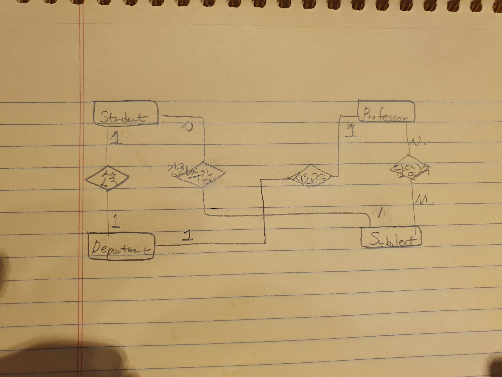

## 개념적 모델링

## 논리적 모델링

student (ssn, name, address, email, phone, **dno**)

Professor (ssn, name, address, phone, email, **dno**)

Dept (dno, dname, phone, office)

subject (sid, sname, credit, ptime, office, **run_professor_ssn**)

subject_charge(**student_ssn**, **pid**)